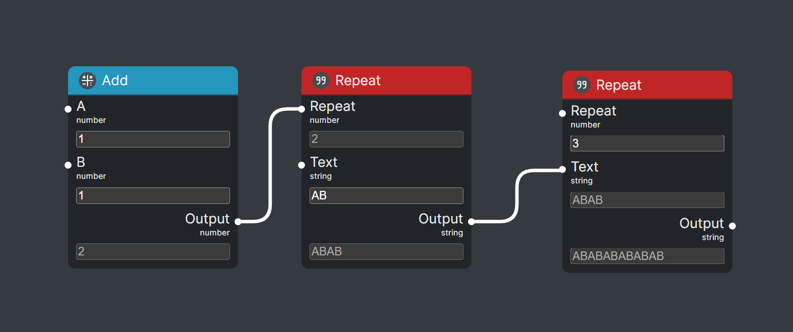

<br />
<div align="center">
  <h3 align="center">Example of Nodes</h3>

<p align="center">
      This is an example of how to create Nodes for the IngoOutgo editor.
      <br/>
      <a href="https://petrosiliuspatter.github.io/ingooutgo/">Full Demo</a>
  </p>
</div>

## Info

- At the core, IngoOutgo uses [Nodl](https://github.com/newfrgmnt/nodl) for its `Nodes`.
  See their documentation for more information.
- In this example, we'll write a `NodeRegistration` for a simple `Node` that repeats a
  string a given number of times. Both the original string and the number of repetitions
  will be inputs, and the repeated string will be the output.
- This example uses Deno, but you can use npm as well. Adjust imports as needed.

## Usage

### Node

- To create a `NodeRegistration`, you first need to create a `Node`. It defines the
  `Inputs` and `Outputs`, together with the `Node`'s logic.
- It is worth noting that only `Inputs` and `Outputs` of the very same `Schema` can be
  connected. For this reason, you should place them in a separate file, to be shared by
  all your `Nodes`.
- See `src\nodes\string\RepeatNode.ts`.

```ts
import { Input, Node, Output, schema } from "../../deps/nodl.ts"
import { z } from "./deps/zod.ts"
import { combineLatest, map } from "../../deps/rxjs.ts"

export const numberSchema = schema("number", z.number())
export const stringSchema = schema("string", z.string())

class RepeatNode extends Node {
  inputs = {
    repeatCount: new Input({
      name: "Repeat",
      type: numberSchema,
      defaultValue: 1,
    }),
    text: new Input({
      name: "Text",
      type: stringSchema,
      defaultValue: "",
    }),
  }

  outputs = {
    output: new Output({
      name: "Output",
      type: stringSchema,
      observable: combineLatest([
        this.inputs.repeatCount,
        this.inputs.text,
      ]).pipe(
        map((inputs) => inputs[1].repeat(Math.floor(Math.max(0, inputs[0])))),
      ),
    }),
  }
}
```

### NodeRegistration

- Then, you need to create a `NodeRegistration` for it. It defines the `Node`'s appearance
  in `IngoOutgo`.
- The id is used to identify the `NodeRegistration`. It should be unique, and not change.
  If it changes, `IngoOutgo` will not be able to load the saved graph.
- The icon is the name of a [Tabler Icon](https://tabler.io/icons).

```ts
import { NodeRegistration } from "../../deps/ingooutgo.ts"
import { createNumberField } from "../../components/NumberField/NumberField.tsx"
import { TextField } from "../../components/TextField/TextField.tsx"

export const repeatNodeRegistraion = new NodeRegistration({
  id: "ingooutgo/nodes-example/string/repeat",
  name: "Repeat",
  node: RepeatNode,
  fieldExtras: {
    repeatCount: { component: createNumberField({ zodNumber: z.number().int().min(0) }) },
    text: { component: TextField },
    output: { component: TextField },
  },
  accentColor: "#c02626",
  icon: "Quote",
})
```

### Components

- You can use any component you want. This TextField uses a simple styled input field. For
  this example I won't go into too much detail. See
  `src\components\TextField\TextField.tsx`.
- The component receives the following props:
  - schema: Z
  - updateFunc?: (value: z.infer<Z>) => void
  - value: z.infer<Z>
  - direction: "incoming" | "outgoing"
  - disabled: boolean

```tsx
import { FieldComponent } from "../../deps/ingooutgo.ts"
import { React } from "../../deps/react.ts"
import { z } from "../../deps/zod.ts"

import { StyledTextInput } from "./styles.ts"

export const TextField: FieldComponent<z.ZodString> = (
  { updateFunc, value, disabled },
) => (
  <StyledTextInput
    type="text"
    disabled={disabled}
    value={value ?? ""}
    onChange={(e) => updateFunc?.(e.target.value)}
  />
)
```

### Catalog

- Finally, you need to add the `NodeRegistration` to the `Catalog`. See
  `src\nodes\string\Catalog.ts`

```ts
import { Catalog } from "../../deps/ingooutgo.ts"

import { repeatNodeRegistraion } from "./RepeatNode.ts"

export const stringCatalog: Catalog = {
  label: "String",
  nodes: [repeatNodeRegistraion],
  subcategories: {},
}
```

### Result

Your node can now be published, and later imported like this:

```
import { mathCatalog, stringCatalog } from 'ingooutgo-example-nodes'
new EditorStore({
  nodes: [],
  subcategories: {
    mathNodes: mathCatalog,
    stringNodes: stringCatalog,
  },
})
```

And will look like this:


